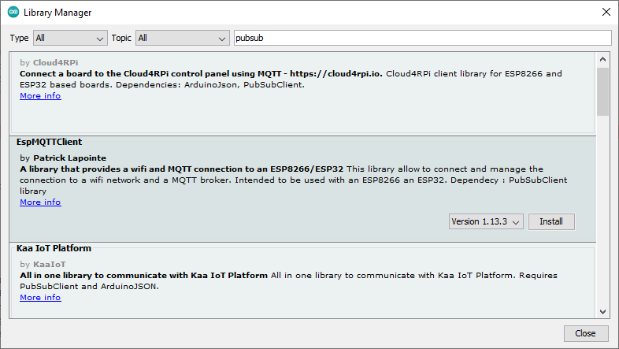

# Implementación de una aplicación MQTT


* https://learn.adafruit.com/alltheiot-transports
* https://learn.adafruit.com/alltheiot-protocols
* http://www.steves-internet-guide.com/mqtt/
* https://learn.sparkfun.com/tutorials/introduction-to-mqtt/all


## Sobre MQTT

Dentro de los diferentes protocolos ([link](https://learn.adafruit.com/alltheiot-protocols)) usados en la industria IoT, el protocolo **MQTT (Message Queue Telemetry Transport)** ([link](https://mqtt.org/)) se ha convertido en uno de los mas populares. El protocolo MQTT (Message Queuing Telemetry Transport) es un protocolo diseñado para transferir mensajes mediante el uso de un modelo **publish and subscribe**. Mediante este modelo, es posible enviar mensajes a 0, 1 o multiples clientes.

![mqtt_adafruit]_(https://cdn-learn.adafruit.com/assets/assets/000/049/298/medium800/customer___partner_projects_adafruit_io_complexmqtt.png?1513278997)

Para permitir la comunicación entre los diferentes dispositivos, MQTT requiere del uso de un Broker central (tal y como se muestra en la figura de abajo (tomada de [link](https://learn.sparkfun.com/tutorials/introduction-to-mqtt/all))):


Tal y como se muestra en la figura anterior, los elementos de involucrados en una red MQTT son:
* **Broker**: Es el servidor encargado de distribuir la información entre los diferentes clientes conectados a la red.
* **Cliente**: Es el dispositivo que se conecta a la red MQTT a traves del broker para enviar y recibir información.

Los mensajes entre los clientes son direccionados por el broker por medio del **topic**. Para transferencia de mensajes en la red MQTT un cliente puede:
* **publish**: en este caso el cliente envia información a broker para que esta sea distribuida a los demas clientes interesados con base en el nombre del **topic**.
* **subscribe**: cuando se suscriben, los clientes indican al broker cuales son los **topic(s)** en los que estos se encuentran interesados, de manera que cualquier mensaje publicado por el broker es distribuido a los clientes que se encuentra **suscritos** (interesados) a dicho topic. Un cliente tambien puede **unsubscribe** a un tipico para parar de recibir mensajes desde el broker a traves de dicho topic.

### Elementos necesarios

Para trabajar con MQTT es necesario tener como minimo instalados los siguientes programas:
1. **El broker**: El software que implementa el broker debe estar instalado en uno de los dispositivos de la red MQTT (normalmente un PC, una RPi, cualquier dispositivo de borde o incluso en la nube) para hacer posible el redireccionamiento de los mensajes. 
2. **Clientes**: Los clientes pueden implentarse como aplicaciones de usuario (como **mosquito_pub**, **mosquito_sub** o **MQTT Explorer**) o pueden integrarsen a programas por medio de algun API MQTT mediante el uso de librerias en algun lenguaje de programación.

Antes de empezar implementar una red MQTT, asegurese de tener instalados los siguientes elementos:
1. Un broker MQTT en una maquina (el mosquitto ([link](https://mosquitto.org/download/)) fue la opción empleada en nuestro caso).
2. Un cliente MQTT para el envio y recepción de paquetes. (En nuestro caso se instalaron como minimo, el mosquitto_pub, el mosquito_sub y el MQTT Explorer)

Despues de realizar esto, es bueno verificar el correcto funcionamiento de las aplicaciones instaladas realizando una prueba sencilla en la que se verifique el funcionamiento del broker y los clientes.

### Implementación de clientes MQTT en las cosas

Por cosas hacemos referencia a los dispositivos que interactuan con el ambiente en la capa de percepción, en otras palabras las placas. En nuestro caso, como estamos trabajando con la placa **ESP32** es necesario instalar las librerias necesarias para que un ESP32 pueda funcionar como cliente en una red MQTT ([EspMQTTClient](https://www.arduino.cc/reference/en/libraries/espmqttclient/)). El repositorio de la libreria **EspMQTTClient** se encuentra en el siguiente [link](https://github.com/plapointe6/EspMQTTClient).

Para llevar a cabo la instalación de esta libreria en el IDE de Arduino, siga los siguientes pasos (ver: Installing an Arduino Library ([link](https://learn.sparkfun.com/tutorials/installing-an-arduino-library/all#using-the-arduino-library-manager))):
1. Abra el administrador de librerias: **Sketch -> Include Library -> Manage Libraries...**
2. Digite en el campo de busqueda la palabra clave **pubsub**, seleccione la libreria **EspMQTTClient** e instalela:



3. Como esta libreria depende se otras dependencias, acepte la opcion que permite la instalación de todas las librerias (Install All) incluyendo las dependencias:


## Caso de prueba

Para comprender una implementación de una red MQTT sencilla vamos a plantear el caso de prueba mostrado en la siguiente figura:


El objetivo en este caso es simular la implementación del control de iluminación de una oficina mediante MQTT. La siguiente tabla describe cada uno de los clientes de la red MQTT:

| Dispositivo | Cliente |Rol|Topic (message-topic)|Mensaje (message)|Observaciones|
|---|---|---|---|---|---|
| PC |C1|publisher| ```home/office/lamp```|<ul><li>```ON```<li>```OFF```</ul>|<ul><li>**```ON```**: Comando con el que se prende la luz de la oficina.<li>**```OFF```**: Comando con el que se prende la luz de la oficina.</ul>|
|C2|ESP32|susbcriber|```home/office/lamp```|```---```|Cuando se recibe el comando **```ON```** se enciende la lampara y cuando se recibe el comando **```OFF```** se apaga la lampara|


* https://www.valvers.com/open-software/arduino/esp32-mqtt-tutorial/#debug-output
* https://cedalo.com/blog/enabling-esp32-mqtt/
* https://randomnerdtutorials.com/esp32-mqtt-publish-subscribe-arduino-ide/
* https://hackmd.io/@fablabbcn/rydUz5cqv
* https://www.hackster.io/harshkc2000/toit-and-esp32-mqtt-based-motion-alert-system-7f281a
* https://esp32tutorials.com/esp32-mqtt-publish-ds18b20-node-red-esp-idf/
* https://doc.asksensors.com/docs/d/s3/connect-esp32-over-mqtt/
* https://learn.sparkfun.com/tutorials/introduction-to-mqtt/all
* https://learn.adafruit.com/adafruit-io/mqtt-api
* https://io.adafruit.com/api/docs/mqtt.html#adafruit-io-mqtt-api
* https://github.com/SensorsIot/MQTT-Examples/blob/master/ESP_MQTT_ADAFRUIT_LIBRARY/ESP_MQTT_ADAFRUIT_LIBRARY.ino
* https://learn.adafruit.com/mqtt-adafruit-io-and-you
* https://learn.adafruit.com/alltheiot-protocols

## Referencias

* https://espressif-docs.readthedocs-hosted.com/projects/arduino-esp32/en/latest/
* https://docs.espressif.com/projects/esp-idf/en/latest/esp32/api-reference/protocols/index.html
* https://esp32tutorials.com/esp32-mqtt-client-publish-subscribe-esp-idf/
* https://learn.sparkfun.com/tutorials/introduction-to-mqtt/all
* http://kio4.com/arduino/curso.htm
* https://github.com/antaresdocumentation/antares-esp32-mqtt
* https://microdigisoft.com/esp32-mqtt-publish-and-subscribe-with-arduino-ide/
* https://forum.arduino.cc/t/esp32-mqtt-client/973629/2
* https://randomnerdtutorials.com/esp32-mqtt-publish-ds18b20-temperature-arduino/
* https://randomnerdtutorials.com/esp32-mqtt-publish-subscribe-arduino-ide/
* https://www.valvers.com/open-software/arduino/esp32-mqtt-tutorial/#debug-output
* https://cedalo.com/blog/enabling-esp32-mqtt/
* http://esp32.net/
* https://ubidots.com/community/t/solved-esp32-subscribing-via-mqtt/2770/2
* https://community.home-assistant.io/t/mqtt-light-and-esp32/125252
* https://randomnerdtutorials.com/esp32-mqtt-publish-ds18b20-temperature-arduino/
* https://hackmd.io/@fablabbcn/rydUz5cqv
* https://www.hackster.io/harshkc2000/toit-and-esp32-mqtt-based-motion-alert-system-7f281a
* http://www.edubox.org/openmqttgateway-un-proyecto-para-convertir-diferentes-protocolos-a-mqtt/
* https://esp32tutorials.com/esp32-mqtt-publish-ds18b20-node-red-esp-idf/
* https://doc.asksensors.com/docs/d/s3/connect-esp32-over-mqtt/
* https://randomnerdtutorials.com/esp32-mqtt-publish-bme280-arduino/
* https://www.theengineeringprojects.com/2021/11/esp32-mqtt.html
* https://learn.adafruit.com/diy-esp8266-home-security-with-lua-and-mqtt
* https://learn.adafruit.com/desktop-mqtt-client-for-adafruit-io
* https://learn.adafruit.com/manually-bridging-mqtt-mosquitto-to-adafruit-io
* https://learn.adafruit.com/alltheiot-protocols
* https://learn.adafruit.com/set-up-home-assistant-with-a-raspberry-pi
* https://learn.adafruit.com/pm25-air-quality-sensor
* https://learn.adafruit.com/search?q=All%2520the%2520Internet%2520of%2520Things
