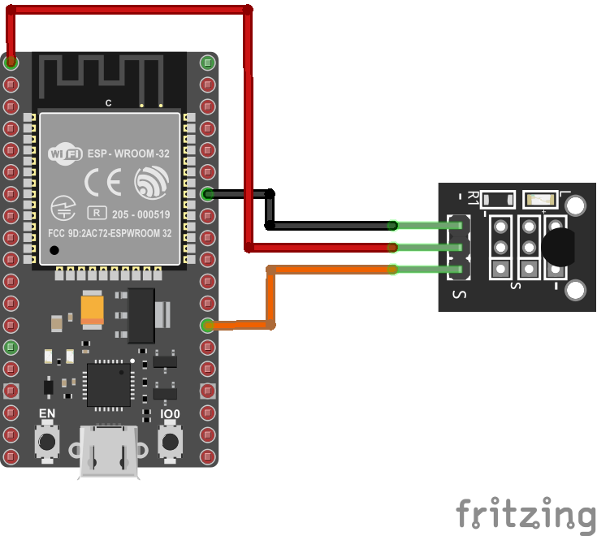
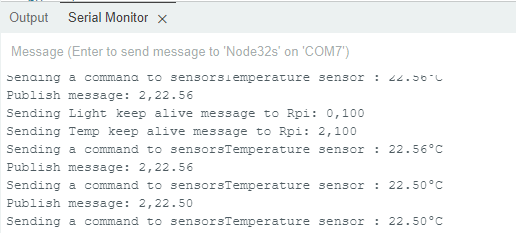
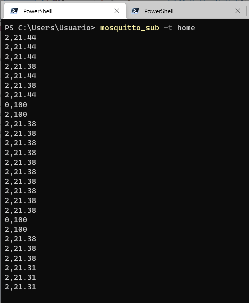

# ESP32 - Temperatura

## Descripción

La siguiente cosa (implementada en una placa ESP32) realiza las siguientes dos tareas:
1. Realiza el sensado de temperatura mediante un sensor de temperatura DS18B20. El valor sensado es enviado (publicado) como un mensaje MQTT al cliente interesado (inscrito en el mismo topic) en este valor.
2. Permite la activación y desactivación de un Rele para controlar la luz de un espacio (la sala por ejemplo). El control de la iluminación se logra gracias a que el

La siguiente tabla muestra los diferentes clientes y su rol que permiten la integración de la alarma en la red MQTT:

| ID Dispositivo | Nombre |Rol|Topic (message-topic)|Mensaje (message)|Observaciones|
|---|---|---|---|---|---|
| 0 |```ESPClient_1```|publisher| ```home```|<ul><li>```2,100```<li>```2,0```<li>```2,xx.yy```</ul>|<ul><li>**```2,100```**: Explicar...<li>**```2,0```**: Explicar.<li>**```2,xx.yy```**: Explicar...</ul>|
| 0 |```ESPClient_1```|susbcriber|```Light/0```|```---```|La recepción de los siguientes comandos causa el siguiente efecto en el ESP32: <ul><li> **```0```**: Apagar luz <li> **```1```**: Encender luz <li> **```2```**: Cambiar el estado actual de la luz al inverso</ul>  |

## Componentes

|#|Descripción|Cantidad|
|---|---|---|
|1|Placa ESP32|1|
|2|DS18B20 Temperature Sensor Module|1|

El hardware se muestra a continuación:



## Codigo 

El código fue tomado de la siguiente [página](https://github.com/jilopezv/IoT/tree/newModel/things-arduino/Temperature_MQTT_esp32). Como se puede observar, el codigo completo de la aplicación se compone (a diferencia de los que se han analizado previamente) de varios archivos los cuales se listan a continuación:
* [config.h](Temperature_MQTT_esp32/config.h)
* [ESP32_Utils.hpp](Temperature_MQTT_esp32/ESP32_Utils.hpp)
* [ESP32_Utils_MQTT.hpp](Temperature_MQTT_esp32/ESP32_Utils_MQTT.hpp)
* [MQTT.hpp](Temperature_MQTT_esp32/MQTT.hpp)
* [Temperature_MQTT_esp32.ino](Temperature_MQTT_esp32/Temperature_MQTT_esp32.ino)

Para comprender el funcionamiento de los archivos [config.h](Temperature_MQTT_esp32/config.h), [ESP32_Utils.hpp](Temperature_MQTT_esp32/ESP32_Utils.hpp), [ESP32_Utils_MQTT.hpp](Temperature_MQTT_esp32/ESP32_Utils_MQTT.hpp), [MQTT.hpp](Temperature_MQTT_esp32/MQTT.hpp) se recomienda que consulte la pagina **CÓMO USAR MQTT EN EL ESP8266/ESP32** ([link](https://www.luisllamas.es/como-usar-mqtt-en-el-esp8266-esp32/)) pues estos archivos se adaptaron de esta pagina. 

A continuación se muestra el archivo [Temperature_MQTT_esp32.ino](Temperature_MQTT_esp32/Temperature_MQTT_esp32.ino) que es el que implementa la logica de la cosa de acuerdo a la descripción:

```ino
/* ----- Include Libraries ----- */
#include <WiFi.h>
#include <PubSubClient.h>

/* ----- Third Libraries ----- */
#include "config.h"  // Set your network SSID and password in this file
#include "MQTT.hpp"
#include "ESP32_Utils.hpp"
#include "ESP32_Utils_MQTT.hpp"

//Libraries for the temperature sensor
#include <OneWire.h> // by Paul Stoffregen
#include <DallasTemperature.h> // by Miles Burton

/* ----- Ports ----- */
#define RELAY LED_BUILTIN    // Pin for builtin led in the esp32 board (Simulate a relay)
const int oneWireBus = 4;    // Pin to connect the temp sensor, pin 4 in my case.


/* ----- Variables ----- */
int light_state = 0;         // Initial led's state
int counter_KA = 0;          //Counter for sending keep alive message each 5 seconds

char msg[50];

/* Topics */
char topic[] = "home";

/* ----- Helper functions (Third party libraries) ----- */

//Set the onewire interface
OneWire oneWire(oneWireBus);

//Set the temp sensor to use the onewire interface
DallasTemperature sensors(&oneWire);

/* ----- Main funtions ----- */

// setup
void setup() {
  // Ports inicialization
  pinMode(RELAY, OUTPUT);    // BUILTIN_LED pin as an output
  digitalWrite(RELAY, LOW);  // Light initial state is OFF
  // Serial setup
  Serial.begin(115200);  
  ConnectWiFi_STA(false);
  InitMqtt();
  delay(1000);
}

// loop
void loop() {
  // Read the temperature value
  Serial.print("Sending a command to sensors");
  sensors.requestTemperatures();

  // Temperature read in celcius
  float temperatureC = sensors.getTempCByIndex(0);

  // Write data to serial monitor 
  Serial.print("Temperature sensor : ");
  Serial.print(temperatureC);
  Serial.println("°C");

  HandleMqtt();

  // Send temperature value to the MQTT server
  // Device ID for temperature : 2
  snprintf (msg, 50, "2,%.2f", temperatureC);
  Serial.print("Publish message: ");
  Serial.println(msg);
  PublisMqttString(topic, msg);

  //Process for sending Keep Alive messages
  counter_KA++;
  if(counter_KA == 10){
    counter_KA = 0;
    /* Since this ESP32 implemented two devices Light(id = 0) and
    *  temperature (id = 2), this node must send two KA messages
    */
    // DeviceID=0,ONLINE_STATE
    snprintf (msg, 50, "0,100" );
    Serial.print("Sending Light keep alive message to Rpi: ");
    Serial.println(msg);
    PublisMqttString(topic, msg);
    // DeviceID,ONLINE_STATE
    snprintf (msg, 50, "2,100" );
    Serial.print("Sending Temp keep alive message to Rpi: ");
    Serial.println(msg);
    PublisMqttString(topic, msg);
  }
  // Read temperature each 5 seconds
  delay(500);
}
```

Antes de adaptar la plantilla a nuestro ejemplo, es necesario conocer la información solicitada en la siguiente tabla:

|Dato|Valor|
|---|---|
|IP del broker|Consultar la IP con el comando ```ifconfig``` o ```ipconfig```|
|SSID AP|Elegir el access point de la red|
|Pasword AP|Consultar el password del access point o dejar el valor vacio si no tiene|

La configuración del broker se lleva a cabo modificando la variable asociada a la IP donde se esta ejecutando el broker (```MQTT_BROKER_ADRESS```) en el archivo [MQTT.hpp](Temperature_MQTT_esp32/MQTT.hpp). Adicionalmente, este archivo es sumamente importante pues aqui se implementa la implementación de la función de suscripción del cliente (```SuscribeMqtt()```) a un topico determinado (En este caso ```Light/0```) y se implementa la logica de recepción de un comando (para prender o apagar el led que simula el relay) en la función ```OnMqttReceived()```. A continuación se muestra este archivo completamente:

```hpp
const char* MQTT_BROKER_ADRESS = "mqtt_broker_IP"; // Ejemplo 192.169.1.4
const uint16_t MQTT_PORT = 1883;
const char* MQTT_CLIENT_NAME = "ESPClient_1";

// Topics
const char* DEVICE_TYPE = "Light";
const char* DEVICE_ID = "0";
#define RELAY LED_BUILTIN

extern int light_state;

WiFiClient espClient;
PubSubClient mqttClient(espClient);

void SuscribeMqtt() {
  char topic_sub[100];
  sprintf(topic_sub,"%s/%s", DEVICE_TYPE, DEVICE_ID);
  mqttClient.subscribe(topic_sub);
}

String payload;
void PublisMqtt(unsigned long data) {
   payload = "";
   payload = String(data);
   mqttClient.publish("hello/world", (char*)payload.c_str());
}

void PublisMqttString(char* topic, char* msg) {
   mqttClient.publish(topic, msg);
}

String content = "";

void OnMqttReceived(char* topic, byte* payload, unsigned int length) {
   Serial.print("Received on ");
   Serial.print(topic);
   Serial.print(": ");

   content = "";   
   for (size_t i = 0; i < length; i++) {
      content.concat((char)payload[i]);
   }
   Serial.print(content);
   Serial.println();

   // This code indicates what to do with the received message
   if((char)payload[0] == '1') {
      light_state=1;
      digitalWrite(RELAY, HIGH);
   }
   else if ((char)payload[0] == '0') {
      light_state=0;
      digitalWrite(RELAY, LOW);
   }
   else if ((char)payload[0] == '2') { 
      // Toggle light 
      if (light_state == 1){
        light_state=0;
        digitalWrite(RELAY, LOW);
      }
      else{
        light_state=1;
        digitalWrite(RELAY, HIGH);
      }
  }
}
```

Por otro lado en el archivo [config.h](Temperature_MQTT_esp32/config.h), se configura la información asociada al access point y al ... (preguntar que es la IP de lo otro).

```h
const char* ssid     = "SSID";
const char* password = "SSID_PASS";
const char* hostname = "ESP32_1"; 
IPAddress ip(192, 168, 200, 10); // 192.169.1.4
IPAddress gateway(192, 168, 200, 7); // 192.169.1.255
IPAddress subnet(255, 255, 255, 0); // 255.255.255.0
```

Una vez hecho esto, ya es posible descargar el codigo en la ESP32. Si todo esta bien, una vez descargado este código la ESP32 se deberá haber enganchado a la red Wifi y a la red MQTT mostrando un mensaje como el siguiente en el monitor serial:


## Pruebas

En la tabla mostrada al principio, vimos que en el ESP32 se implementaron un cliente que suscribia y uno que publicaba de modo que los objetivos de la prueba de test serán:
* Verificar que los mesajes donde se envia la información de la temperatura sensada desde la ESP32 esten de acuerdo con la logica descrita en la tabla para el cliente que publica (ESP32).
* Verificar, que el comportamiento del ESP32 responde de acuerdo con los requerimientos de la aplicación cuando este recibe el mensaje MQTT con el fin de activar o desactivar la luz que simula el relee. Para esto se revisara que el cliente que suscribe en el ESP32 funcione adecuadamente al recibir un comando desde un cliente externo que publica.

Para realizar la prueba vamos a emplear los clientes **```mosquitto_pub```** y **```mosquitto_sub```** teniendo en cuenta que el broker **```mosquitto```** ha sido previamente iniciado. La siguiente tabla muestra los clientes implementados mediante los clientes mosquitto:

| Dispositivo | Aplicación |Rol|Topic (message-topic)|Mensaje (message)|Observaciones|Comando empleado|
|---|---|---|---|---|---|---|
| Computador |Cliente ```mosquitto_pub```|publisher| ```Light/0```|Comandos enviados: <ul><li> **```0```**: Apagar luz <li> **```1```**: Encender luz <li> **```2```**: Cambiar el estado actual de la luz al inverso</ul> |Estos comandos se envian al cliente que suscribe en el ESP32 prendiendo o apagando la luz (led integrado a la placa) asociada al rele|Comandos enviados desde la consola: <ul> <li>```mosquitto_pub -t Light/0 -m 0```<li>```mosquitto_pub -t Light/0 -m 1```<li>```mosquitto_pub -t Light/0 -m 2```</ul>|
|Computador |Cliente ```mosquitto_sub```|susbcriber|```home```|```---```| En la consola de este cliente se imprimiran los mensajes enviados desde el cliente que publica en el ESP32. Mas  especificamente información relacionada con la temperatura|Comando ejecutado: <br>```mosquitto_sub -t home```|

Antes de empezar no olvide abrir la terminal que va a suscribir a ```home``` el comando ```mosquitto_sub -t home``` tal y como se muestra a continuación:


A continuación se muestra el orden de las pruebas realizado:

1. Se que el ESP32 estuviera enviando la temperatura sensada. El resultado del monitor serial para el ESP32 se muestra a continuación:

   
   
   Si todo esta bien, estos mensajes se deben desplegar en la consola del ```mosquitto_sub``` la información asociada a la temperatura y otros mensajes que dan cuenta del estado el la conexión de la cosa. La siguiente figura muestra este resultado:

   

2. Se realizaron las pruebas para verificar el control del rele conectado a la cosa. Para esto, se envio desde la terminal del **mosquito_pub** los diferentes comandos (```0```, ```1``` y ```2```) al topico ```Light/0``` lo cual se reflejo en el apagado y encendido del led integrado a la placa ESP32. La primera prueba fue el apagado del led para lo cual se envio el comando tal y como se muestra en la siguiente figura:
   
   

   El efecto en el ESP32 del comando anterior, es que se apaga el led integrado a la ESP32. Para prender el led, se envia el comando de encendido desde la consola cliente tal y como se muestra a continuación:
   
   

   Finalmente, se envia de manera repetida el comando para cambiar el estado del led al contrario (si esta prendido, el comando hace que se apague y viceversa). En la siguiente figura se muestra el resultado de mandar dos veces este comando:
   
   


## Referencias

* https://github.com/jilopezv/IoT/tree/newModel/things-arduino
* https://fluxworkshop.com/blogs/getting-started/lets-workshop-lc-technology-rw1820-temperature-sensor-module
* https://www.analog.com/media/en/technical-documentation/data-sheets/ds18b20.pdf
* https://randomnerdtutorials.com/guide-for-ds18b20-temperature-sensor-with-arduino/
* https://arduinomodules.info/ky-001-temperature-sensor-module/
* https://randomnerdtutorials.com/esp32-ds18b20-temperature-arduino-ide/#:~:text=Introducing%20DS18B20%20Temperature%20Sensor,to%20communicate%20with%20your%20ESP32
* https://fluxworkshop.com/blogs/getting-started/lets-workshop-lc-technology-rw1820-temperature-sensor-module
* Sensor es el de la pagina 72 del libro de elegoo.


