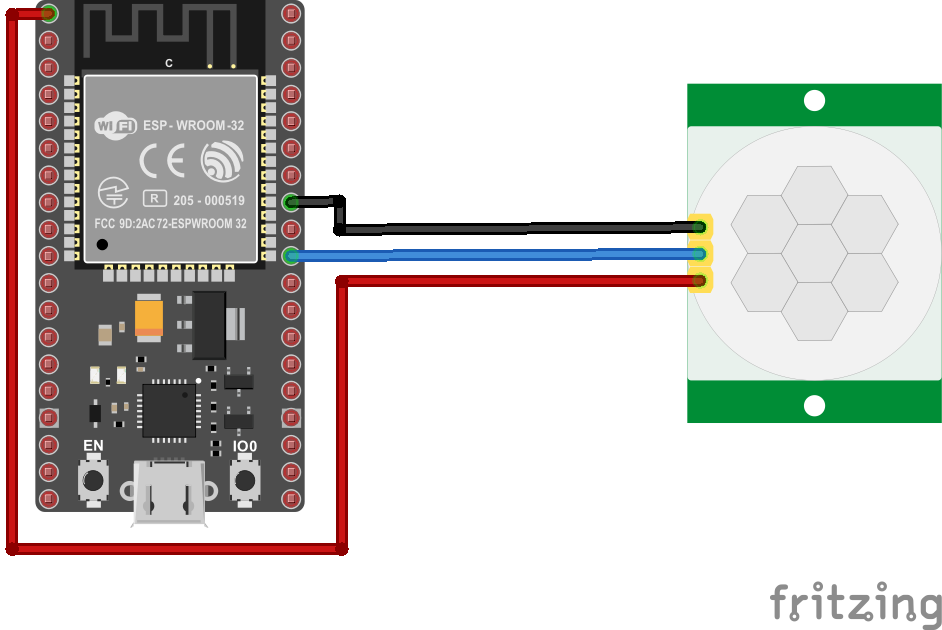
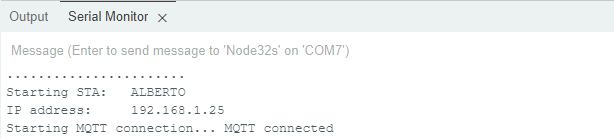
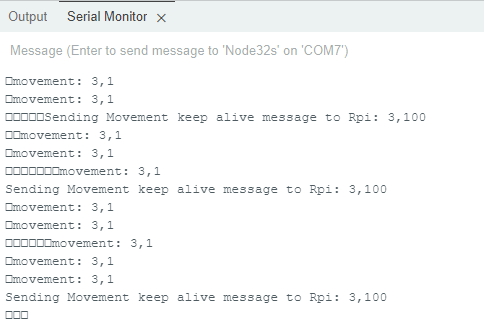
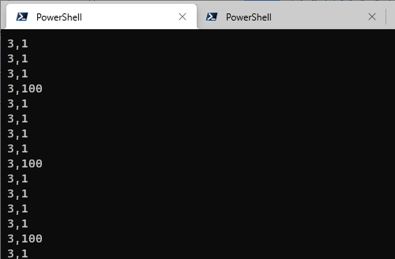
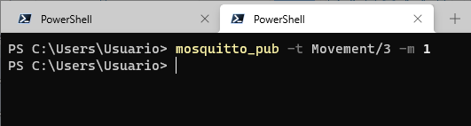
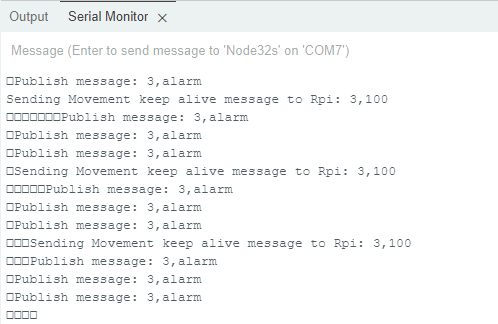
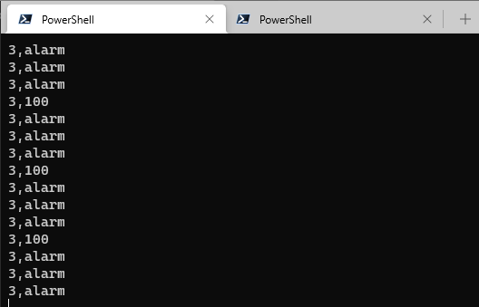
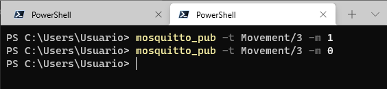

# ESP32 - PIR

## Descripción


| ID Dispositivo | Nombre |Rol|Topic (message-topic)|Mensaje (message)|Observaciones|
|---|---|---|---|---|---|
| 3 |```ESPClient_2```|publisher| ```home```|<ul><li>```3,1```<li>```3,alarm```<li>```3,100```</ul>|<ul><li>**```3,1```**: Explicar...<li>**```3,alarm```**: Explicar.<li>**```3,100```**: Explicar...</ul>|
|3 |```ESPClient_2```|susbcriber|```Movement/3```|```---```|La recepción de los siguientes comandos causa el siguiente efecto en el ESP32: <ul><li> **```1```**: Modo vigia <li> **```0```**: Modo normal </ul>  |

## Componentes

|#|Descripción|Cantidad|
|---|---|---|
|1|Placa ESP32|1|
|2|Sensor PIR HC-SR501|1|

El hardware se muestra a continuación:



## Codigo 

```ino
/* ----- Include Libraries ----- */
#include <WiFi.h>
#include <PubSubClient.h>

/* ----- Third Libraries ----- */
#include "config.h"  // Set your network SSID and password in this file
#include "MQTT.hpp"
#include "ESP32_Utils.hpp"
#include "ESP32_Utils_MQTT.hpp"

/* ----- Ports ----- */
#define PIR_MOTION_SENSOR 5               // Pin for PIR sensor in the esp32 board

/* ----- Variables ----- */
long mov_timer = 0;
long ka_timer = 0;

char msg[50];
int value = 0;

// Variable state represents home state-> 0 normal  - 1 lookout
char home_state = 0;

/* Topics */
char topic[] = "home";

/* ----- Main funtions ----- */

// setup
void setup() {
  // set PIN_PIR a pin as an input
  pinMode(PIR_MOTION_SENSOR, INPUT);   
  // Serial setup
  Serial.begin(115200);  
  ConnectWiFi_STA(false);
  InitMqtt();
  delay(5000);
}

// loop
void loop() {
  HandleMqtt();
  long now = millis(); 
  //get PIR data each 500ms 
  if (now - mov_timer > 500) { 
    mov_timer = now;
    Serial.print(home_state);
    if(digitalRead(PIR_MOTION_SENSOR)){//if it detects the moving people?
        if (home_state){
          // lookout state      
          //Serial.println("Hi,people is coming");
          snprintf (msg, 50, "3,alarm");
          Serial.print("Publish message: ");
          Serial.println(msg);
          // sending alarm to gateway!!!
          //client.publish("casa/pir", msg);
          PublisMqttString(topic, msg);
        } else{
          // normal state and movement detected
          snprintf (msg, 50, "3,1");
          Serial.print("movement: ");
          Serial.println(msg);
          PublisMqttString(topic, msg);
        }
    }
  }

  // Sending Keep Alive message each 5 seconds
  if (now - ka_timer > 5000) { 
    ka_timer = now;
    // DeviceID=3,ONLINE_STATE
    snprintf (msg, 50, "3,100" );
    Serial.print("Sending Movement keep alive message to Rpi: ");
    Serial.println(msg);
    PublisMqttString(topic, msg);
  }
  
}
```

Antes de adaptar la plantilla a nuestro ejemplo, es necesario conocer la información solicitada en la siguiente tabla:

|Dato|Valor|
|---|---|
|IP del broker|Consultar la IP con el comando ```ifconfig``` o ```ipconfig```|
|SSID AP|Elegir el access point de la red|
|Pasword AP|Consultar el password del access point o dejar el valor vacio si no tiene|

La configuración del broker se lleva a cabo modificando la variable asociada a la IP donde se esta ejecutando el broker (```MQTT_BROKER_ADRESS```) en el archivo [MQTT.hpp](PIR_MQTT_esp32/MQTT.hpp):


```hpp
const char* MQTT_BROKER_ADRESS = "mqtt_broker_IP"; // Ejemplo 192.169.1.4
const uint16_t MQTT_PORT = 1883;
const char* MQTT_CLIENT_NAME = "ESPClient_2";
...
```

Por otro lado en el archivo [config.h](PIR_MQTT_esp32/config.h), se configura la información asociada al access point y al ... (preguntar que es la IP de lo otro).

```h
const char* ssid     = "SSID";
const char* password = "SSID_PASS";
const char* hostname = "ESP32_PIR_1"; 
IPAddress ip(192, 168, 200, 10); // 192.169.1.4
IPAddress gateway(192, 168, 200, 7); // 192.169.1.255
IPAddress subnet(255, 255, 255, 0); // 255.255.255.0
```

Una vez hecho esto, ya es posible descargar el codigo en la ESP32. Si todo esta bien, una vez descargado este código la ESP32 se deberá haber enganchado a la red Wifi y a la red MQTT mostrando un mensaje como el siguiente en el monitor serial:




## Pruebas

En la tabla mostrada al principio, vimos que en el ESP32 se implementaron a continuación se describe el plan de prueba.

### Verificar que se esta enviando desde la información asociada al sensor PIR.

1. Normal

En estado normal, el ESP32 publica al **```topic = Motion/3```** los mensajes **```3,1```** y **```3,100```**. Esto se muestran en la terminal serial del ESP32 asi:



En la consola de un cliente mosquito como suscriptor sale




2. Alarma



El resultado se muestra en:





3. Alarma Off



El resultado sera nuevamente similar a lcaso normal, a continuación muestra el resultaso en la consola del mosquito...


Aca vamos...

